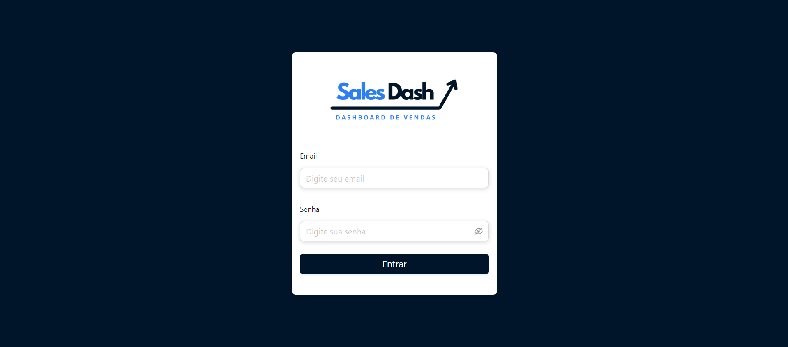
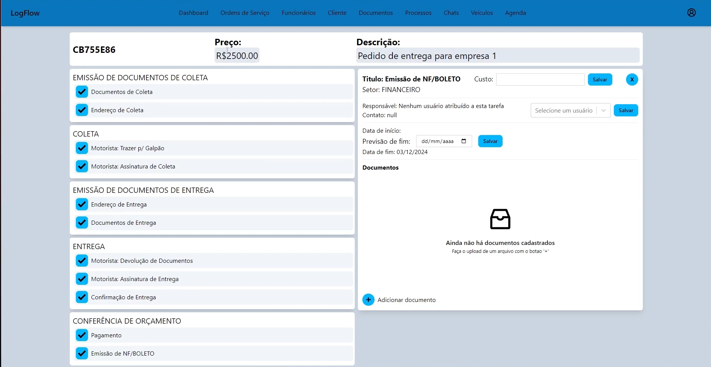
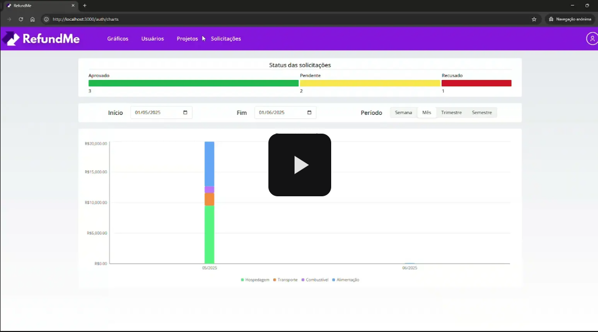
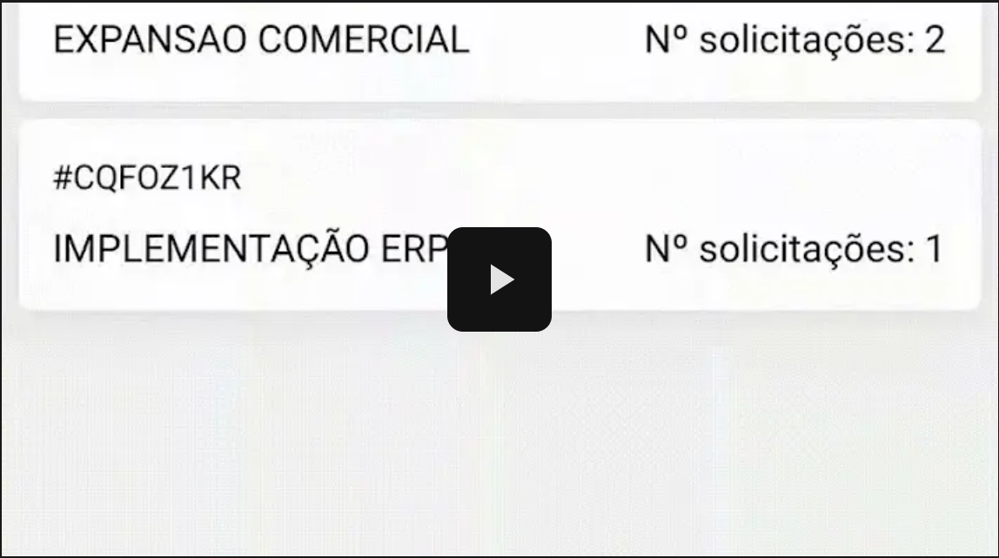

<h1 align="center"> Sobre mim </h1>

  

Desde pequeno, sempre fui fascinado por tecnologia, jogos e computadores. Esse interesse natural me levou a querer entender melhor como as coisas funcionam por trás das telas, e foi isso que despertou minha vontade de seguir carreira na área de tecnologia.

Durante o ensino médio, tive a oportunidade de atuar como auxiliar de TI na minha escola, o que me proporcionou um primeiro contato prático com o ambiente de suporte técnico e infraestrutura. Essa experiência reforçou ainda mais minha decisão de me aprofundar na área de tecnologia da informação.

Atualmente, sou estudante do curso superior de Análise e Desenvolvimento de Sistemas e estou em busca da minha primeira oportunidade de estágio na área de desenvolvimento. Estou sempre buscando aprender novas ferramentas, linguagens e práticas de mercado para me preparar da melhor forma para os desafios do mercado de trabalho.

Neste documento, apresento todos os Projetos Integradores que desenvolvi ao longo da graduação, além de listar as tecnologias com as quais já tive contato e com as quais possuo familiaridade.

---

## 🚀 Tecnologias e Conhecimentos

### 🖥️ Linguagens de Programação

  
  

### 🗄️ Bancos de Dados

  
  

### 📚 Frameworks e Bibliotecas

  
  
  
  
  

### 🌐 Outros

  
  
  

---

## 📞 Contato

  

---

## 📚 Projetos Desenvolvidos  

  
🎓 Projeto - 1º Semestre (2023-1)

### 📌 Empresa Parceira

Cliente interno (Fatec São José dos Campos), instituição de ensino superior focada em tecnologia, com Professores Egydio e Jean como, respectivamente, P2 e M2.

### ❗ Problema  

Os alunos ingressantes na instituição apresentavam dificuldade em compreender e aplicar o método Scrum. A falta de um recurso centralizado, intuitivo e com fontes de informação variadas resultava em uma curva de aprendizado lenta e baixo engajamento com as metodologias ágeis exigidas pelo curso.

### 💡 Solução  

Detalhes

Scrum Academy é um projeto que busca disseminar o método Scrum de maneira fácil e acessível. No Scrum Academy, buscamos reunir todo o conteúdo de Scrum num só lugar e apresentar ao estudante interessado suas ferramentas, métodos, características e aplicações.

Nosso site permite que qualquer pessoa com ou sem experiência com a metodologia aprenda desde as ferramentas básicas até dicas de como aprimorar suas habilidades pessoais no dia a dia do trabalho.

### 🔗 Repositório  

[Link para o repositório](https://github.com/ColossusAPI/ScrumAcademy)

### 🛠️ Tecnologias Utilizadas  

- **Python**: Utilizado para o desenvolvimento da lógica de negócio e rotas do backend junto do flask, a logica do questionario foi feita utilizando python.

- **HTML**: Utilizado na estruturação das páginas web, garantindo a organização semântica dos elementos na interface do usuário.

- **CSS**: Responsável pela estilização das páginas, permitindo personalização visual e adequação à identidade visual do projeto.

- **Bootstrap**: Framework utilizado para agilizar o desenvolvimento do front-end com componentes responsivos e estilos prontos, otimizando a criação da interface com foco em usabilidade e compatibilidade entre dispositivos.

### 👨‍💻 Contribuições Pessoais  

Atuando como membro do **Dev Team**, minhas contribuições se concentraram tanto no front-end quanto no back-end.

No back-end, utilizei **Python** para auxiliar na construção da lógica de negócio e nas rotinas de manipulação de dados. Participei ativamente da integração do sistema e da organização de tarefas utilizando o GitHub.

No front-end, colaborei na estruturação das páginas com **HTML** e **CSS**, aplicando **Bootstrap** para garantir a responsividade da interface. Contribuí também com ajustes visuais e melhorias de usabilidade da aplicação.

### 📈 Hard Skills  

- **Python** – Faço/uso com autonomia
- **HTML** – Tenho conhecimento básico e consigo aplicar em projetos simples
- **CSS** – Tenho conhecimento básico e consigo realizar ajustes visuais simples
- **Bootstrap** – Conhecimento básico, utilizado para estruturar layouts e aplicar componentes prontos

### 🤝 Soft Skills  

Desenvolvi a habilidade de **trabalho em equipe**, essencial para o desenvolvimento de um código base coeso utilizando o GitHub.

Além disso, pratiquei a **comunicação interpessoal** ao sugerir e discutir melhorias, como a implementação dos cards do YouTube ao final de cada tópico, facilitando o alinhamento do time e aprimorando o produto final.

  
🎓 Projeto - 2º Semestre (2023-2)

### 📌 Empresa Parceira  

Este projeto foi realizado com cliente interno (Fatec São José dos Campos), instituição de ensino superior focada em tecnologia, com Claudio e Giuliano como, respectivamente, M2 e P2.

### ❗ Problema  

Havia uma dificuldade significativa em extrair informações específicas e contextuais de arquivos de texto extensos. O processo manual de leitura e busca era demorado e ineficiente, e as IAs populares da época não ofereciam interação direta com o conteúdo de documentos fornecidos pelo usuário.

### 💡 Solução    

  
Detalhes

O Parrot AI é um chatbot avançado construído em Java, impulsionado pela poderosa biblioteca langchain. Sua principal habilidade reside na capacidade de compreender e responder perguntas detalhadas relacionadas a um arquivo específico. Com o uso do processamento de linguagem natural, este chatbot oferece interações inteligentes e contextuais, permitindo aos usuários extrair informações precisas e relevantes do conteúdo do arquivo carregado.

### 🔗 Repositório  

[Link para o repositório](https://github.com/C0demain/ParrotAI)

### 🛠️ Tecnologias Utilizadas  

- **Java**: Utilizado para o desenvolvimento do projeto como um todo, tanto para construção do crud de usuario quanto para as telas desktop utilizadas

- **JavaSwing**: Utilizado para a criação das telas desktop da aplicação

- **Langchain**: Bibiloteca usada para manipular o modelo de linguagem utilizado no projeto, versão especifica para java chamada langchain4J

### 👨‍💻 Contribuições Pessoais  

Neste projeto, atuei como **Scrum Master**, facilitando as cerimônias ágeis e garantindo o fluxo de trabalho da equipe.

Além das responsabilidades de gestão, minha contribuição técnica focou na otimização do modelo de linguagem. Realizei pesquisas e testes para melhorar o processamento dos arquivos enviados, o que incluiu a implementação de lógicas de limpeza e divisão dos textos em blocos (chunks) menores, facilitando a análise pelo modelo. Também fui responsável por testar diferentes modelos de linguagem, selecionando o `sentence-transformers/all-MiniLM-L6-v2` (Hugging Face) como a versão final devido ao seu equilíbrio entre performance e eficiência.

### 📈 Hard Skills  

- **Java** – Uso com autonomia
- **langchain** – Tenho conhecimento para aplicar em projetos simples

### 🤝 Soft Skills  

Exerci ativamente a **comunicação** e a **empatia**, essenciais para identificar e resolver bloqueios que um membro da equipe estava enfrentando, ajudando-o a se reintegrar ao ritmo do projeto.

A gestão do **trabalho em equipe** foi crucial para manter o time alinhado e produtivo, garantindo que todos seguissem a mesma cadência de entregas.

  
🎓 Projeto - 3º Semestre (2024-1)

### 📌 Empresa Parceira

Projeto desenvolvido com a Pro4Tech, uma empresa de consultoria e desenvolvimento de software, com professores Masanori e Claudio como, respectivamente, P2 e M2.

### ❗ Problema  

A empresa enfrentava dificuldades no gerenciamento de comissões de vendas. O processo era realizado de forma manual, o que gerava falta de visibilidade, erros de cálculo e consumo excessivo de tempo da equipe. Além disso, não havia uma forma centralizada de cadastrar vendas, seja manualmente ou em lote, nem de aplicar filtros complexos para análise de desempenho.

### 💡 Solução  

- Clique na imagem para ser redirecionado e assistir ao vídeo mostrando os detalhes da aplicação:
  

  
Detalhes

O desafio do terceiro semestre consiste no desenvolvimento de uma Dashboard de Comissões de Vendas, denominada "Sales Dash", em parceria com a empresa Pro4Tech. Este sistema tem como objetivo receber dados de vendas e apresentar informações detalhadas sobre as comissões dos vendedores, calculando e exibindo essas comissões com base em diferentes tipos de vendas, conforme descrito a seguir:

Produto novo para novo cliente
Produto antigo para novo cliente
Produto novo para cliente antigo
Produto antigo para cliente antigo

Cada tipo de venda estará associado a um plano de remuneração específico, o qual poderá ser configurado para determinar o bônus atribuído a cada vendedor.

### 🔗 Repositório  

[Link para o repositório](https://github.com/C0demain/sales-dash)

### 🛠️ Tecnologias Utilizadas  

- **typescript**: linguagem de programação utilzada para o desenvolvimento da aplicação, utilizado no frontend e backend
- **node**: usado no backend para rodar a aplicação
- **postgresql**: banco de dados relacional utilizado no projeto
- **react**: framework utilizado para o desenvolvimento do frontend

### 👨‍💻 Contribuições Pessoais  

Atuando como membro do **Dev Team**, concentrei meus esforços no back-end. Fui responsável por desenhar a lógica de relacionamento entre as entidades de usuários e vendas e implementar os métodos CRUD (criação, exclusão e atualização) para as vendas.

Desenvolvi a funcionalidade de upload de planilhas para cadastro em massa, incluindo validações essenciais (como verificação de existência de clientes ou produtos) para garantir a correta atribuição de comissões. Também atuei ativamente na correção de bugs e problemas lógicos que surgiram durante o desenvolvimento.

### 📈 Hard Skills  

- **typescript** – uso com autonomia
- **node** – uso com autonomia
- **postgresql** – uso com autonomia
- **react** – cosigo utilizar, mas preciso de consultas

### 🤝 Soft Skills  

Neste projeto, aprimorei minha capacidade de **comunicação** e **argumentação técnica**. Durante as discussões sobre a implementação de novas funcionalidades, apresentei argumentos claros para defender a priorização do upload de planilhas, demonstrando como essa funcionalidade era vital para o sucesso do projeto e convencendo a equipe de sua importância.

  
🎓 Projeto - 4º Semestre (2024-2)

### 📌 Empresa Parceira

Projeto realizado com a JJM Log, empresa especializada em logística e transportes, com os professores Sabha e Juliana como, respectivamente, M2 e P2.

### ❗ Problema  

A gestão dos processos logísticos da empresa era descentralizada e manual. A falta de um sistema unificado causava atrasos na comunicação, dificuldade no rastreamento de ordens de serviço (desde entregas até processos internos como holerites) e falta de visibilidade sobre os custos operacionais, impactando a eficiência geral.

### 💡 Solução  

- Clique na imagem para ser redirecionado e assistir ao vídeo mostrando os detalhes da aplicação:
  

  
Detalhes

O desafio do quarto semestre consiste no desenvolvimento de uma sistema, chamado Logflow, que permita o acompanhamento de diversas ordens de serviços em diferentes setores e etapas durante o atendimento da empresa JJM Log, contando com diversas ferramentas como chat em tempo real, calendario de eventos, upload de imagens e e visão geral via dashboard.

### 🔗 Repositório  

[Link para o repositório](https://github.com/C0demain/logflow)

### 🛠️ Tecnologias Utilizadas  

- **Typescript**: utilizado como linguagem de progrmação para o frontend e backend
- **Nestjs**: framework utilizado para o desenvolvimento do backend, modularizando a aplicação
- **Nodejs**: utilizado para rodar a aplicação do backend
- **Nextjs**: framework utilizado para a construção do frontend

### 👨‍💻 Contribuições Pessoais  

Como membro do **Dev Team**, tive foco intenso no back-end. Fui responsável pela criação de módulos completos (seguindo a estrutura MVC) para as principais entidades do sistema: ordens de serviço, usuários, arquivos e veículos.

Minhas entregas incluíram o desenvolvimento de testes unitários para todos os _services_ e _controllers_, garantindo a qualidade do código. Além disso, implementei rotas personalizadas para atender demandas específicas de dashboards e gráficos.

### 📈 Hard Skills  

- **Typescript**: uso com autonomia
- **Nestjs**: uso com autonomia
- **Nodejs**: uso com autonomia
- **Nextjs**: consigo utilizar em projetos simples

### 🤝 Soft Skills  

Exerci a **comunicação** proativa, buscando alinhamento constante com o Product Owner (P.O.) para esclarecer requisitos de funcionalidades complexas.

Desenvolvi também o **autoaprendizado** e a **adaptação**, pois o projeto exigiu o uso de um framework (NestJS) que não fazia parte da grade curricular, demandando estudo independente para realizar as entregas.

  
🎓 Projeto - 5º Semestre (2025-1)

### 📌 Empresa Parceira

Projeto desenvolvido com a GSW, empresa especializada em desenvolvimento de software e soluções corporativas, com professores Ronaldo e Gerson como, respectivamente, M2 e P2.

### ❗ Problema  

O processo de reembolso corporativo da GSW era manual, lento e suscetível a erros. Os funcionários tinham dificuldade em enviar comprovantes e acompanhar o status de suas solicitações. Para os gestores, faltava um fluxo de aprovação claro e uma forma de visualizar e validar os pedidos, gerando gargalos administrativos.

### 💡 Solução  

- Clique na imagem para ser redirecionado e assistir ao vídeo mostrando os detalhes da aplicação web:
  

- Clique na imagem para ser redirecionado e assistir ao vídeo mostrando os detalhes da aplicação mobile:
  

  
Detalhes

O projeto RefundMe foi desenvolvido como parte do desafio prático proposto pela empresa GSW Software para os alunos do 5º semestre do curso de Análise e Desenvolvimento de Sistemas da Fatec São José dos Campos.

A proposta consiste em desenvolver um sistema completo de reembolso corporativo, onde funcionários possam registrar suas solicitações de reembolso de despesas, anexar comprovantes e acompanhar o status de aprovação. O sistema também conta com um painel administrativo exclusivo para gestores aprovarem ou rejeitarem as solicitações com base em regras pré-definidas, como limites por projeto.

Além da aplicação mobile, também foi desenvolvido um backoffice web e uma API robusta com deploy em nuvem.

### 🔗 Repositório  

[Link para o repositório](https://github.com/C0demain/refundme)

### 🛠️ Tecnologias Utilizadas  

- **Node.js**: utilizado para rodar a aplicação do backend

- **Typescript**: utilizado como linguagem de progrmação para o frontend e backend

- **Mongoose**: biblioteca utilizada para modelar e gerenciar dados no MongoDB

- **next.js**: biblioteca utilizada para a construção do frontend web, criando interfaces de usuário interativas

- **React Native**: framework utilizado para o desenvolvimento da aplicação mobile nativa usando JavaScript

- **Expo**: plataforma que facilita o desenvolvimento e deploy de apps móveis com React Native

### 👨‍💻 Contribuições Pessoais  

Como membro do **Dev Team**, assumi responsabilidades complexas no back-end. Implementei a lógica de armazenamento seguro de imagens utilizando um bucket S3 da AWS com URLs assinadas (presigned URLs) para garantir o acesso controlado aos comprovantes.

Além disso, modelei a lógica de relacionamento entre as entidades (Projeto, Solicitação e Despesa) para refletir a estrutura organizacional e as regras de negócio do cliente.

### 📈 Hard Skills  

- **Node.js**: uso com autonomia

- **Typescript**:uso com autonomia

- **MongoDB**: uso com autonomia

- **next.js**: consigo utilizar em projetos simples

- **React Native**: consigo utilizar em projetos simples

- **Expo**: consigo utilizar em projetos simples

### 🤝 Soft Skills  

Neste projeto, exerci a **tomada de decisão técnica**, avaliando e definindo a stack ideal para os desafios do back-end. Optei pela integração de um cluster MongoDB com os serviços da AWS (S3), uma escolha que se mostrou eficaz.

A **comunicação** foi fundamental para apresentar essas decisões técnicas e alinhar a implementação com o restante da equipe.

  
🎓 Projeto - 6º Semestre (2025-2)

### 📌 Empresa Parceira

Projeto desenvolvido com a Xertica.ai, empresa especializada em desenvolvimento de software e soluções integradas com inteligencia artificial, com professores Claudio e Walmir como, respectivamente, M2 e P2.

### ❗ Problema

Os pacientes enfrentavam dificuldade em manter consistência alimentar, falta de orientação prática e personalizada, sobrecarga de informações contraditórias sobre nutrição e insegurança em relação às escolhas alimentares no dia a dia. Não havia uma ferramenta que oferecesse suporte nutricional acessível, personalizado e inteligente de forma contínua.

### 💡 Solução

- Clique na imagem para ser redirecionado e assistir ao vídeo mostrando os detalhes da aplicação:
  

  
Detalhes

O NutriXpert é um agente conversacional inteligente baseado no Google Gemini, desenvolvido para oferecer suporte personalizado em nutrição. O sistema interage de forma natural com o usuário, coletando informações sobre saúde, hábitos alimentares, restrições e objetivos nutricionais.

O agente é capaz de preencher anamnese, gerar dietas completas personalizadas, reformular planos alimentares com base na ingestão semanal do usuário, estimar distribuição de macronutrientes, fornecer resumos de progresso e insights automáticos sobre os avanços do paciente. O projeto foi dividido em três repositórios independentes (agent, backend e frontend), refletindo uma arquitetura desacoplada e moderna.

### 🔗 Repositório

[Link para o repositório](https://github.com/C0demain/nutriXpert)

### 🛠️ Tecnologias Utilizadas

- **Python**: utilizado para o desenvolvimento do agente conversacional, processando as interações com o usuário

- **Java**: utilizado para o desenvolvimento do backend com Spring Boot, responsável pela lógica de negócio, autenticação e persistência de dados

- **Spring Boot**: framework utilizado para construir a API REST do backend, garantindo segurança, escalabilidade e integração com o agente

- **PostgreSQL**: banco de dados relacional utilizado para armazenar dados de usuários, anamneses, refeições e históricos

- **Chroma DB**: banco de dados vetorizado utilizado no agente para armazenar e recuperar informações contextuais do paciente

- **Google ADK**: Framework de orquestração e criação de agentes

- **FastAPI**: framework utilizado para construir a API do agente, permitindo comunicação rápida e eficiente com o backend

- **Langchain**: Framework utilizado para ingestão de documentos, vetorização e buscas de similaridade via RAG

- **Vue.js**: framework utilizado para o desenvolvimento do frontend, criando uma interface de usuário moderna e responsiva

### 👨‍💻 Contribuições Pessoais

Como membro do **Dev Team**, atuei em duas frentes principais: backend e agente.

No **backend**, fui responsável por implementar funcionalidades críticas do sistema, incluindo a criação de endpoints para cadastro e atualização de dados da anamnese. Desenvolvi a lógica de integração entre o backend (Spring Boot) e o agente (Python/FastAPI), garantindo a comunicação eficiente entre os serviços. Também implementei validações de dados e tratamento de exceções para garantir a consistência e segurança das informações armazenadas.

No **agente**, contribuí com a criação inicial do agente fazendo o modelo base a ser utilizado durante o projeto junto do sistema de interação via chamadas de api e Runner. Funcionalidades como a funcionalidades para o agente como a busca dos dados do usuario para memória do agente, criação e atualização da anamnese via conversa por chat com o agente

### 📈 Hard Skills

- **Python**: uso com autonomia
- **Java**: uso com autonomia
- **Spring Boot**: uso com autonomia
- **PostgreSQL**: uso com autonomia
- **FastAPI**: consigo utilizar em projetos simples
- - **Langchain**: consigo utilizar em projetos simples
- **Chroma DB**: tenho conhecimento para aplicar em projetos simples
- **Vue.js**: consigo utilizar em projetos simples

### 🤝 Soft Skills

Neste projeto, aprimorei significativamente minha **colaboração em equipe**, trabalhando de forma integrada entre diferentes repositórios (backend e agente) e coordenando com desenvolvedores de outras frentes (frontend) para garantir a integração fluida entre os serviços.

Desenvolvi também o **pensamento analítico** e a **resolução de problemas complexos**, especialmente ao lidar com a arquitetura desacoplada do projeto e a integração entre diferentes tecnologias (Java/Spring Boot com Python/FastAPI). A necessidade de garantir que os dados fluíssem corretamente entre backend, agente e banco de dados vetorizado exigiu análise cuidadosa e debugging constante.

A **adaptabilidade** foi essencial, pois o projeto envolveu trabalhar com tecnologias novas para mim, como Chroma DB e modelos LLM, exigindo aprendizado rápido e aplicação prática de conceitos avançados de IA e processamento de linguagem natural.

